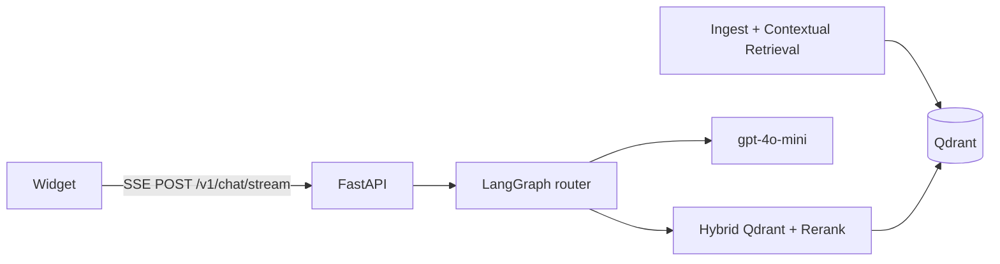

# Multilingual RAG Customer Support Chatbot

> **한국어 번역본**
>
> 기준 영문 문서: [README.md](README.md)
> 번역 기준 리포지토리 커밋:
> `d0ef3f025f7f6a940c224f5de5759bdaed2f1def` (M9 packaging baseline; follow-up docs sync)
> 동기화 날짜: 2026-07-21
>
> 영문 문서와 내용이 충돌할 경우 영문 문서를 우선합니다.

[English](README.md) | 한국어

**한국어, 영어, 일본어, 중국어**를 1급으로 지원하는 프로덕션 지향 RAG 챗봇입니다.

| 계층 | 선택 |
|-------|--------|
| API | FastAPI (async) + SSE |
| Orchestration | LangGraph |
| Retrieval | Qdrant hybrid (dense + sparse) · `PREFER_BGE=true` 일 때 **BGE-M3** (hash offline fallback) |
| Reranker | BGE-reranker-v2-m3 (lexical offline fallback) |
| LLM (default) | **OpenAI gpt-4o-mini** (`LLM_PROVIDER=openai`) |
| Eval | RAGAS-style runner (`app/eval`); faithfulness gate; AR diagnostic |
| Observability | Langfuse (optional; no-op without keys) |
| Deps | **uv** + `pyproject.toml` (Python 3.12); optional **`bge`** group for BGE-M3 |

**상태 (2026-07-21):** **M0–M9 리포지토리 구현 완료.** M8-B staging BGE validation **PASS**; M9 프로덕션 패키징 완료 및 로컬 검증됨. **실제 프로덕션 배포는 수행되지 않았고**, **프로덕션 트래픽 컷오버는 승인되지 않음**; 플랫폼 의사결정이 여전히 필요합니다.
See [MILESTONES.md](MILESTONES.md) · [SPEC.ko.md](SPEC.ko.md) · [docs/staging-cutover-bge.md](docs/staging-cutover-bge.md) · [docs/production-deployment.md](docs/production-deployment.md).

## Architecture



## Quick start

```bash
uv sync --all-groups
cp .env.example .env   # set OPENAI_API_KEY for live gpt-4o-mini

# Vector DB (requires Docker)
docker compose up -d qdrant

# Optional: ingest sample FAQs (uses MOCK_LLM if no API key)
MOCK_LLM=1 uv run python scripts/ingest.py --path data/sample_docs --recreate

# BGE-M3 deps (optional; required when PREFER_BGE=true)
# uv sync --group bge

# API
MOCK_LLM=1 uv run uvicorn app.main:app --reload --host 127.0.0.1 --port 8000

curl -sf http://127.0.0.1:8000/health   # liveness
curl -sf http://127.0.0.1:8000/ready    # readiness (Qdrant + collection + embedder snapshot)
```

### Embed widget (one script tag)

```html
<!-- Floating button -->
<script
  src="http://127.0.0.1:8000/widget/chatbot-widget.js"
  data-api-base="http://127.0.0.1:8000"
  data-mode="floating"
></script>
```

Inline mode:

```html
<div id="support-chat"></div>
<script src="http://127.0.0.1:8000/widget/chatbot-widget.js" data-mrc-autoload="false"></script>
<script>
  MultilingualChatbot.init({
    apiBase: "http://127.0.0.1:8000",
    mode: "inline",
    mount: "#support-chat",
  });
</script>
```

데모 페이지: [widget/demo.html](widget/demo.html) · SSE contract: [docs/sse-contract.md](docs/sse-contract.md)

### Nginx note for SSE

```nginx
proxy_buffering off;
proxy_read_timeout 3600;
```

## Configuration

| Variable | Default | Meaning |
|----------|---------|---------|
| `LLM_PROVIDER` | `openai` | Default OpenAI |
| `OPENAI_API_KEY` / `LLM_API_KEY` | — | OpenAI API key |
| `LLM_MODEL` | `gpt-4o-mini` | Single model for contextualize, graph, RAGAS |
| `LLM_TEMPERATURE` | `0.2` | Generation temperature |
| `LLM_MAX_TOKENS` | `1024` | Max completion tokens |
| `QDRANT_URL` | `http://localhost:6333` | Vector DB |
| `QDRANT_COLLECTION` | `support_faq` | Active collection (staging BGE: `onlybook_faq_bge_m3_v1`) |
| `PREFER_BGE` | `false` | `true` = BGE-M3 dense (dim 1024); must match collection |
| `RETRIEVAL_LANGUAGE_FILTER` | `true` | Filter hybrid search by detected language |
| `MOCK_LLM` | `false` | Offline mock completions |
| `RETRIEVAL_TOP_N` / `TOP_K` | 40 / 6 | Hybrid then rerank (then prune to ≤3 sources) |

## Evaluation (RAGAS runner)

교차 언어 데이터셋: `app/eval/dataset/cross_lingual_v1.jsonl` (≥3 intents × 4 languages).

| Metric | 기본 역할 | Initial | Release |
|--------|-----------|---------|---------|
| **Faithfulness** | **하드 릴리스 게이트** | ≥ 0.78 | ≥ 0.82 |
| **Answer relevancy** | **진단 전용** (보고됨; 기본 실패 조건 아님) | ≥ 0.75 (참고) | ≥ 0.78 (참고) |

Answer relevancy를 하드 게이트로 쓰려면 `--gate-answer-relevancy`를 명시합니다.

```bash
# Wiring / mock gate
uv run python -m app.eval.run_ragas \
  --dataset app/eval/dataset/cross_lingual_v1.jsonl \
  --mock --output artifacts/eval/report_mock.json

# Initial live gate (needs models + optional Qdrant)
# 기본: faithfulness만 하드 게이트; answer_relevancy는 진단 전용
uv run python -m app.eval.run_ragas \
  --dataset app/eval/dataset/cross_lingual_v1.jsonl \
  --tier initial \
  --fail-under faithfulness=0.78,answer_relevancy=0.75 \
  --output artifacts/eval/report_initial.json

# 선택: answer_relevancy도 하드 게이트
#   ... --gate-answer-relevancy
```

리포트에는 항상 전체 지표와 **`by_language`** 분해가 포함됩니다.

## Docs

- [docs/chunking.md](docs/chunking.md) — CJK 시맨틱 청킹 + 수동 리뷰
- [docs/retrieval.md](docs/retrieval.md) — hybrid + reranker 지연/비용
- [docs/sse-contract.md](docs/sse-contract.md) — 고정된 위젯 SSE 이벤트

## Development

```bash
uv run ruff check app tests
uv run pytest tests/unit -q
./scripts/smoke_sse.sh http://127.0.0.1:8000
./scripts/e2e_smoke.sh http://127.0.0.1:8000
```

통합 테스트(`pytest -m integration`)에는 동작 중인 Qdrant가 필요합니다.

## Docker Compose

```bash
export MOCK_LLM=true
docker compose build api
docker compose up -d
curl -sf http://localhost:8000/health
```

## Extending languages

1. `app/utils/language.py`에 감지기 alias 추가
2. `data/sample_docs/<lang>/` 아래 샘플 문서 추가
3. `app/eval/dataset/`에 병렬 eval 행 추가
4. 선택: 청킹 fallback에 언어별 토크나이저 플러그인

## Privacy

제3자 트레이서에 원본 PII를 마스킹 없이 기록하지 마세요. Langfuse는 키가 설정되지 않으면 **off**입니다.

## License

별도 명시가 없으면 Proprietary / project-local입니다.
