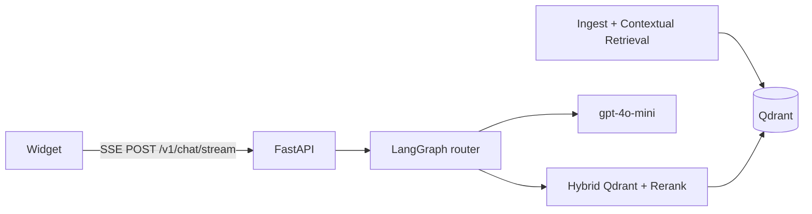

# Multilingual RAG Customer Support Chatbot

English | [한국어](README.ko.md)

Production-oriented RAG chatbot with first-class support for **Korean, English, Japanese, and Chinese**.

| Layer | Choice |
|-------|--------|
| API | FastAPI (async) + SSE |
| Orchestration | LangGraph |
| Retrieval | Qdrant hybrid (dense + sparse) · **BGE-M3** when `PREFER_BGE=true` (hash offline fallback) |
| Reranker | BGE-reranker-v2-m3 (lexical offline fallback) |
| LLM (default) | **OpenAI gpt-4o-mini** (`LLM_PROVIDER=openai`) |
| Eval | RAGAS-style runner (`app/eval`); faithfulness gate; AR diagnostic |
| Observability | Langfuse (optional; no-op without keys) |
| Deps | **uv** + `pyproject.toml` (Python 3.12); optional **`bge`** group for BGE-M3 |

**Status (2026-07-20):** M0–M7 complete; **M8-A** FAQ atomic chunking and **M8-B** BGE-M3 technical implementation complete; **staging BGE cutover validation** complete. Production cutover planning and **M9** packaging are next.
See [MILESTONES.md](MILESTONES.md) · [SPEC.md](SPEC.md) · [docs/staging-cutover-bge.md](docs/staging-cutover-bge.md).

## Architecture



## Quick start

```bash
uv sync --all-groups
cp .env.example .env   # set OPENAI_API_KEY for live gpt-4o-mini

# Vector DB (requires Docker)
docker compose up -d qdrant

# Optional: ingest sample FAQs (uses MOCK_LLM if no API key)
MOCK_LLM=1 uv run python scripts/ingest.py --path data/sample_docs --recreate

# BGE-M3 deps (optional; required when PREFER_BGE=true)
# uv sync --group bge

# API
MOCK_LLM=1 uv run uvicorn app.main:app --reload --host 127.0.0.1 --port 8000

curl -sf http://127.0.0.1:8000/health   # liveness
curl -sf http://127.0.0.1:8000/ready    # readiness (Qdrant + collection + embedder snapshot)
```

### Embed widget (one script tag)

```html
<!-- Floating button -->
<script
  src="http://127.0.0.1:8000/widget/chatbot-widget.js"
  data-api-base="http://127.0.0.1:8000"
  data-mode="floating"
></script>
```

Inline mode:

```html
<div id="support-chat"></div>
<script src="http://127.0.0.1:8000/widget/chatbot-widget.js" data-mrc-autoload="false"></script>
<script>
  MultilingualChatbot.init({
    apiBase: "http://127.0.0.1:8000",
    mode: "inline",
    mount: "#support-chat",
  });
</script>
```

Demo page: [widget/demo.html](widget/demo.html) · SSE contract: [docs/sse-contract.md](docs/sse-contract.md)

### Nginx note for SSE

```nginx
proxy_buffering off;
proxy_read_timeout 3600;
```

## Configuration

| Variable | Default | Meaning |
|----------|---------|---------|
| `LLM_PROVIDER` | `openai` | Default OpenAI |
| `OPENAI_API_KEY` / `LLM_API_KEY` | — | OpenAI API key |
| `LLM_MODEL` | `gpt-4o-mini` | Single model for contextualize, graph, RAGAS |
| `LLM_TEMPERATURE` | `0.2` | Generation temperature |
| `LLM_MAX_TOKENS` | `1024` | Max completion tokens |
| `QDRANT_URL` | `http://localhost:6333` | Vector DB |
| `QDRANT_COLLECTION` | `support_faq` | Active collection (staging BGE: `onlybook_faq_bge_m3_v1`) |
| `PREFER_BGE` | `false` | `true` = BGE-M3 dense (dim 1024); must match collection |
| `RETRIEVAL_LANGUAGE_FILTER` | `true` | Filter hybrid search by detected language |
| `MOCK_LLM` | `false` | Offline mock completions |
| `RETRIEVAL_TOP_N` / `TOP_K` | 40 / 6 | Hybrid then rerank (then prune to ≤3 sources) |

## Evaluation (RAGAS runner)

Cross-lingual set: `app/eval/dataset/cross_lingual_v1.jsonl` (≥3 intents × 4 languages).

| Tier | Faithfulness | Answer relevancy |
|------|--------------|------------------|
| **Initial** | ≥ 0.78 | ≥ 0.75 |
| **Release** | ≥ 0.82 | ≥ 0.78 |

```bash
# Wiring / mock gate
uv run python -m app.eval.run_ragas \
  --dataset app/eval/dataset/cross_lingual_v1.jsonl \
  --mock --output artifacts/eval/report_mock.json

# Initial live gate (needs models + optional Qdrant)
uv run python -m app.eval.run_ragas \
  --dataset app/eval/dataset/cross_lingual_v1.jsonl \
  --tier initial \
  --fail-under faithfulness=0.78,answer_relevancy=0.75 \
  --output artifacts/eval/report_initial.json
```

Reports always include overall metrics and **`by_language`** breakdown.

## Docs

- [docs/chunking.md](docs/chunking.md) — CJK semantic chunking + manual review
- [docs/retrieval.md](docs/retrieval.md) — hybrid + reranker latency/cost
- [docs/sse-contract.md](docs/sse-contract.md) — frozen widget SSE events
- [docs/staging-cutover-bge.md](docs/staging-cutover-bge.md) — staging BGE cutover runbook
- [docs/production-deployment.md](docs/production-deployment.md) — production packaging / rollback (not cutover approval)

## Development

```bash
uv run ruff check app tests
uv run pytest tests/unit -q
./scripts/smoke_sse.sh http://127.0.0.1:8000
./scripts/e2e_smoke.sh http://127.0.0.1:8000
```

Integration tests (`pytest -m integration`) require a live Qdrant.

## Docker Compose

```bash
export MOCK_LLM=true
docker compose build api
docker compose up -d
curl -sf http://localhost:8000/health
```

### Production packaging (repository only — not cutover approval)

- Template: `.env.production.example` (`APP_ENV=production`, `MOCK_LLM=false`)
- Override: `docker-compose.production.yml` (external `APP_IMAGE`, restart, stop grace, healthcheck)
- Runbook: [docs/production-deployment.md](docs/production-deployment.md)
- Runtime hard rejection: production + `MOCK_LLM=true` fails at settings/startup; provider API key required for openai/xai/grok in production

```bash
docker compose --env-file .env.production.example \
  -f docker-compose.yml -f docker-compose.production.yml config
```

**Actual production cutover is NOT approved.** Platform decisions (TLS, secrets, registry, HA) remain required.
## Extending languages

1. Add detector aliases in `app/utils/language.py`
2. Add sample docs under `data/sample_docs/<lang>/`
3. Add parallel eval rows in `app/eval/dataset/`
4. Optional: language-specific tokenizer plug-in in chunking fallback

## Privacy

Do not log raw PII to third-party tracers without redaction. Langfuse is **off** unless keys are set.

## License

Proprietary / project-local unless otherwise specified.
